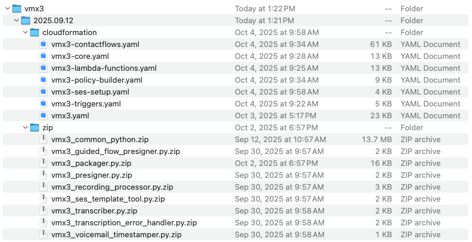
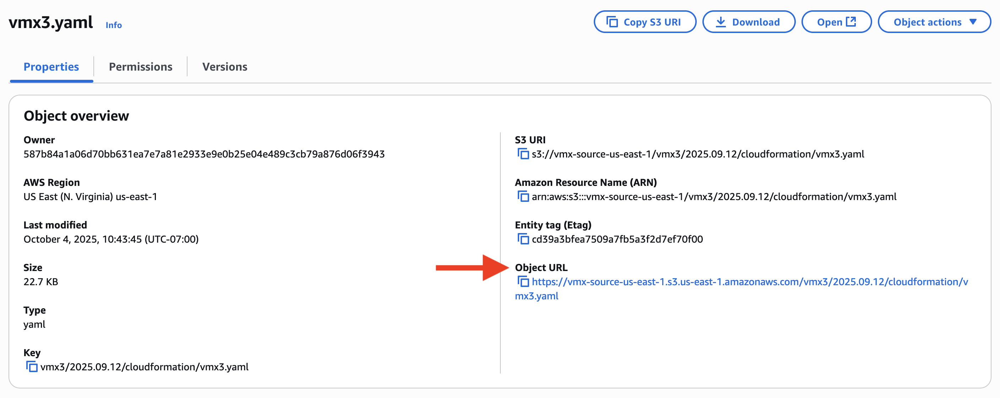

# GovCloud Deployments
GovCloud deployments follow the same pattern as standard deployments. The primary difference is that the deployment package must be loaded to an S3 bucket within the the account to conform with the more stringent security requirements of GovCloud deployments. Outside of that requirement, the deployment process is the same. 

-  Complete the [installation prerequisites](vmx_prerequistes.md). Once those are complete, you can continue with the process below.

## Gather Required Information (All deployments)
Voicemail Express is deployed via AWS CloudFormation. In order to launch the template, you will need the following information:
-  ARN for the Amazon Kinesis data stream used for streaming your CTRs from the [Amazon Kinesis Data streams console](https://console.aws.amazon.com/kinesis/home)

> [!Important] 
> This solution is designed to receive CTRs via Kinesis Data Streams only, not Kinesis Firehose. It WILL NOT work with a Kinesis firehose.

-  Amazon Connect Instance Alias from the [Amazon Connect console](https://console.aws.amazon.com/connect/home)
-  Amazon Connect Instance ARN from the [Amazon Connect console](https://console.aws.amazon.com/connect/home)
-  Amazon Connect Call Recordings bucket ARN
-  Default agent ID to use for testing
-  Default queue ARN to use for testing

## Gather Required Information (Email deployments **ONLY**)
-  Default FROM email address. This will be the default address used to send emails FROM if no other address is configured or provided.
-  Default TO email address. This will be the default address used to send emails TO if no other address is configured or provided. 

Once you have the required information, you are ready to continue with the deployment.

## Create an S3 Bucket to host the templates and code
During the deployment, several AWS Lambda functions will be deployed. The code for those functions is in ZIP files stored in S3. The bucket must be in the same region as your Amazon Connect instances. For typical deployments, those ZIP files are stored in public-facing buckets. In GovCloud deployments, we prefer to home the Zip files and cloud formation templates within the same account. This also allows for better control of the resources, as well as provides you with the opportunity to run virus/security scans against those resources if desired.

1.  Create a new S3 bucket that follows this naming convention:
    -  unique prefix name + -vmx-source-us-gov-west-1
    -  FOR EXAMPLE: vmxdougjaso-vmx-source-us-gov-west-1
    -  Make sure to remember your prefix
1.  Once created, create a new folder named `vmx3` in the new bucket
1.  Download the [full VMX deployment package zip file](https://vmx-source-us-gov-west-1.s3.us-west-2.amazonaws.com/vmx3_version_2025.09.12.zip).
1.  Extract the top-level contents of the file and upload the version folder to the new folder you created in your S3 bucket. The contents of the folder should resemble the image below:

1. **Copy the Object URL for the vmx3.yaml file** (Example below)

> [!IMPORTANT]  
> The preceeding step is critical. The solution is deploying from resources in your environment. Do not attempt to deploy to govcloud from the standard template. The deployment will fail.

## Deploy the solution
1.  In the `cloudformation` folder, find the `vmx3.yaml` file. 
1.  Open the [AWS Console](https://console.aws.amazon.com).
1.  Navigate to **CloudFormation**.
1.  Select **Create stack** and choose **With new resources (standard)**.
1.  In the **Specify template** section, select **Amazon S3 URL** and paste the Object URL for the vmx3.yaml file that you copied in the previous step.
1.  Update the stack name to include your instance alias, for example such as `VMX3-MyInstanceName`
3.  **Complete the parameters** using the information that you have gathered.
3.  In the **7. Advanced Settings - Use only in customized deployments** section, set the **(ADVANCED/GovCloud USE ONLY) What is the bucket prefix for your custom code S3 bucket?** field, enter the bucket prefix that you used earlier when creating your bucket, followed by a hyphen. For example, if your bucket prefix was `mygovcloud`, you would enter `mygovcloud-`
3.  Once the parameters are complete, choose **Next**
3. 	Scroll to the bottom and select **Next**
3. 	Scroll to the bottom, select the boxes to **acknowledge that IAM resources will be created**
3.  Select **Submit**
3.  The deployment will take 3-5 minutes. During this time, multiple nested stacks will be deployed. Once the main stack shows **CREATE_COMPLETE**, you are ready to proceed.

## Assign a test number
1.  Login to the Amazon Connect administration interface
1.  Select **Channels** from the navigation menu, then choose **Phone numbers**
1.  Either select an existing number, or claim a new number
1.  Set the contact flow for the number to **VMX3-AWSTestFlow-YOURINSTANCE**.
1.  Select **Save**

## Test Voicemail Delivery as an Amazon Connect Guided Task
If you have deployed Voicemail Express with the Amazon Connect Guided Tasks delivery option, you can validate functionality by performing the following test.
1.  **Dial** the phone number you configured for the Voicemail Test Line.
1.  At the first menu, **press 2** to select Task delivery.
1.  At the next menu, **press 1** to leave a voicemail for an agent or **press 2** to leave a voicemail for a queue.
1.  Select the appropiate option to enable the generative AI summary, if desired.
1.  When you hear the tone, **record your voicemail**. Hang up at any time after recording a message.
1.  Once you have completed the recording, **wait approximately 2 minutes**.
1.  Log the appropriate agent in **to the agent workspace or a custom CCP with guides enabled** and put them into the available state. The Guided Task should arrive shortly.

## Test Voicemail Delivery as an Amazon Connect Task
If you have deployed Voicemail Express with the Amazon Connect Tasks delivery option, you can validate functionality by performing the following test.
1.  **Dial** the phone number you configured for the Voicemail Test Line.
1.  At the first menu, **press 1** to select Task delivery.
1.  At the next menu, **press 1** to leave a voicemail for an agent or **press 2** to leave a voicemail for a queue.
1.  Select the appropiate option to enable the generative AI summary, if desired.
1.  When you hear the tone, **record your voicemail**. Hang up at any time after recording a message.
1.  Once you have completed the recording, **wait approximately 2 minutes**.
1.  Log the appropriate agent in and put them into the available state. The Task should arrive shortly.

## Test Voicemail Delivery as an Email using Amazon Simple Email Service (SES)
If you have deployed Voicemail Express with the email delivery option, you can validate functionality by performing the following test.
1.  **Dial** the phone number you configured for the Voicemail Test Line.
1.  At the first menu, **press 3** to select email delivery.
1.  At the next menu, **press 1** to leave a voicemail for an agent or **press 2** to leave a voicemail for a queue.
1.  Select the appropiate option to enable the generative AI summary, if desired.
1.  When you hear the tone, **record your voicemail**. Hang up at any time after recording a message.
1.  Once you have completed the recording, **wait approximately 2 minutes**.
1.  Access the appropriate email box to verify delivery of the voicemail.

## Test Voicemail Delivery as an Amazon Connect Task with the In Queue Voicemail
If you have deployed Voicemail Express with the Amazon Connect Tasks delivery option, you can validate the In-Queue experience by performing the following test.
1.  **Dial** the phone number you configured for the Voicemail Test Line.
1.  At the first menu, **press 4** to select Task delivery.
1.  At the next menu, **press 1** to leave a voicemail.
1.  Select the appropiate option to enable the generative AI summary, if desired.
1.  When you hear the tone, **record your voicemail**. Hang up at any time after recording a message.
1.  Once you have completed the recording, **wait approximately 2 minutes**.
1.  Log the appropriate agent in and put them into the available state. The Task should arrive shortly.

**Voicemail Validation is complete!**