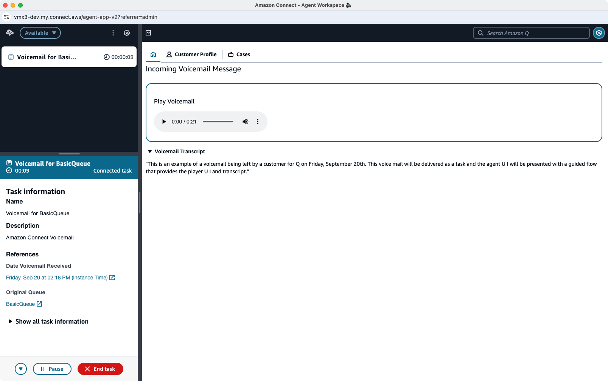

# Delivering Voicemails as Amazon Connect Guided Tasks
Delivering voicemail as an Amazon Connect Guided Task is the most secure and visual option available. Outside of making sure that the queues and routing profiles in Amazon Connect are configured to allow tasks, there is really no additional setup required. Contact flows are provided as an example with the solution, and are suitable for normal use. Tasks are queued and presented to agents just as any other contact would be, with a visual presentation using Agent Guides. In the guide, the agent will see an audio player UI to listen to the voicemail recording. The transcript will also be presented in a collapsible section. All other contact attributes, including the customer callback number, are included in the task information.

## Additional Contact Attributes Specific to Guided Tasks
There is only one additional contact attribute that applies to this delivery model:
-  **vmx3_guided_task_flow (Optional)**: (Contact flow ID) contact ID of a custom task flow used to process tasks generated by the voicemail configuration. If this is not provided, the default flow configured during implementation will be used.
    -  Example: 'vmx_task_flow':'509a1915-cd54-4632-a923-6dafc5b722a9'

## Additional Notes
1.  In the routing profiles for agents that will handle voicemail tasks, you need to make sure that Task is enabled in the **Set channels and concurrency** section. Additionally, you need to make sure that the individual queues in the routing profile also have **Task** selected (for queues where voicemail is allowed).