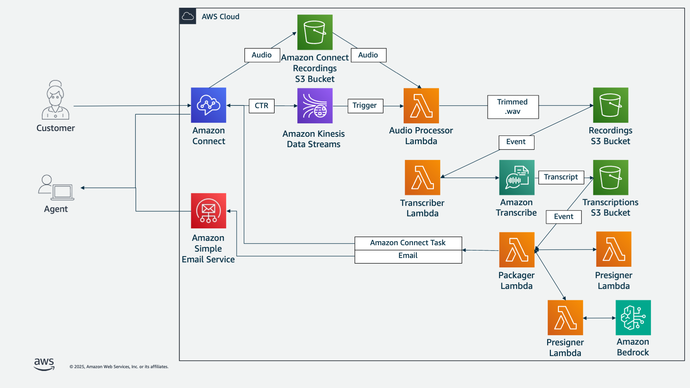

# Voicemail Express V3
Voicemail Express is designed to provide basic voicemail functionality to Amazon Connect. It has been designed to work seamlessly behind the scenes, providing voicemail options for all agents and queues by default. It is an evolution of the Voicemail Express solution that was created specifically for Service Cloud Voice customers by the AWS team that worked with Salesforce to develop Service Cloud Voice. That solution has been cloned and included with Service Cloud Voice, and is now used at scale by customers on that offering. This version removes the Salesforce-centric options, providing the same easy-to-deploy-and-use voicemail option for standard Amazon Connect customers. Typically speaking, Voicemail Express can be deployed and validated in less than 15 minutes. 

## What's new in VMX3 (2025.09.12)
### New Features
**New Recording Process**

Switched to built-in Amazon Connect IVR recording. KVS is no longer used or required. Removes the costs and complexities of the KVS solution. Built-in IVR recording provides a faster, more scalable option. New VMXT3-Voicemail-Timestamper Lambda function marks the time that voicemail recording started so that the solution still works in environemnts where 100% IVR recording is also in use. 

**Generative AI Summary Option**

Provides the option to generate a summary of the voicemail using generative AI. This helps users more quickly identify who called, why, and how to get in touch with them. Option can be toggled on a call by call basis, and also set as an instance default. Default model for all regions except GovCloud is Nova Lite. GovCloud uses Claude Sonnet.

**Better Direct Agent Routing**

Uses the preferred agent routing criteria option instead of using agent personal queues. This makes it easier for managers to re-allocate voicemail in the event of an agent being unavailble for extended periods, and also preserves queue reporting data, while still allowing for personal engagement for agents with direct customer relationships. 

**Deploy to Govcloud**

With the change from KVS, all solution components are now available in GovCloud.

**Added In Queue Voicemail Option**

Provided example flows and added in-queue voicemail option to the main test flow.

-  **Security Enhancements**: 
   -  Support for bucket versioning
   -  Validated operation with customer-managed KMS keys. Documented setup changes.
-  **Performance Validation**:
   -  Validated functionality for voicemails up to 25 minutes long, including generative summary
   -  Load tested voicemail capabilities up to 2000 voicemails per hour
-  **Example Flows**:
   -  Sample queue flow demonstrating how to cleanly do an uninterruptable voicemail while in a queue flow
   -  Sample agent whisper flow which removes the voicemail flag when an agent is connected to a caller who was leaving a voicemail
-  **Documentation Updates**: 
   -  Documented changes needed to support voicemail messages >5 minutes
   -  Documented configuration allowing for voicemail self-service
   -  Documented configuration for in-queue voicemails
-  **Fixes/Improvements:**
   -  Truncating voicemail transcripts longer than 2048 bytes ensure task compatability
   -  Additional filtering for better performance in high volume environments
   -  Updated keys for recordings and transcripts to make files easier to find
   -  Updated all functions to Python 3.13
   -  Updated logging and error handling in functions
   -  Updated view for agent guide
   -  Updated HTML layout for email delivery
   -  Updated packager function code to modularize key capabilities
   -  Added tags to all taggable resources fior better administration and monitoring
   -  Added tagging to voicemail contacts to provide more controlled access to tasks in self-service modes
   -  Standardized formatting across Lambda functions
   -  Fixed MIME type on wav files to allow for playing within browser when clicking presigned URL links

## How it works
With Voicemail Express, customers can have the option to leave a voicemail for an individual agent or an Amazon Connect Queue. Once the voicemail is recorded, a series of processes take place in the following order:
1. Voicemail recording is extracted and stored in S3 as a .wav file
1. The recording is transcribed using Amazon Transcribe
1. (If necessary) A presigned URL is generated that provides access to the voicemail recording without the need for further authentication
1. The voicemail is packaged for delivery, including the transcription, optional generative AI summary, presigned URL, and contact data. It is then delivered as an Amazon Connect Task, Guided Task, or via email using Amazon Simple Email Service (SES), depending on your configuration.

Voicemail presigned URLs are configured for a maximum length of 7 days. After 7 days, the presigned URL is no longer valid. A seperate timeframe is configured for the recordings, which are lifecycled as desired once that timeframe is met. During deployment, you have the option to configure the lifecycle window, if desired. Additionally, you have the option to keep, archive, or delete voicemail recordings. 

## Deployment and Management
### How to deploy
To deploy Voicemail Express, you will need to complete the following:
1. Complete the [Voicemail Express Prerequisites](Docs/vmx_prerequistes.md)
1. Complete the [Voicemail Express Installation](Docs/vmx_installation_instructions.md) (all regions EXCEPT GovCloud)
1. Complete the [Voicemail Express Installation](Docs/vmx_govcloud_deployments.md) (For GovCloud)

### How to upgrade
To upgrade Voicemail Express, follow the [Upgrade Your Installation](Docs/vmx_upgrade.md) instructions.

### How to uninstall
To remove Voicemail Express follow the instructions below:
1.  [Removing/Uninstalling Voicemail Express](Docs/vmx_uninstall.md)

## Using Voicemail Express
Once Voicemail Express has been deployed, you can learn more about the core functions and additional options by reading the documentation below.

### Core Capabilities
-  [High-level overview of the Voicemail Express solution](Docs/vmx_core.md)
-  [More about the Amazon Connect Guided Tasks delivery mode](Docs/vmx_guided_tasks.md)
-  [More abnout the Amazon Connect Tasks delivery mode](Docs/vmx_tasks.md)
-  [More abnout the email delivery mode](Docs/vmx_email.md)

### Additional Options
-  [Allow agents to self-service voicemails](Docs/vmx_selfserve.md)
-  [Present voicemail options to customers in queue](Docs/vmx_inqvm.md)
-  [Give customers more time to leave voicemail messages](Docs/vmx_longer_messages.md)
-  [Configure customer-managed KMS keys for buckets and streams](Docs/vmx_cmkms.md)

## Troubleshooting, Support, and Changelog
-  [Troubleshooting Common Voicemail Issues](Docs/vmx_troubleshooting.md)
-  [How to get support](Docs/vmx_support.md)
-  [View the change log](Docs/vmx_changelog.md)

## Roadmap
The following items are currently planned for future releases. Changes to roadmap depend on feedback, however one overarching tenet of Voicemail Express is to keep the solution lightweight, with a minimal number of required services and administration, and to replace functionality with native Amazon Connect features as soon as they become available. 

-  Reduce dependence on services external to Amazon Connect
-  Move to Contact Lens-generated transcriptions once available with IVR recordings
-  Include recordings as attachments to Tasks once available, removing the need for presigned URLs on task-based voicemails

## Current Published Version
### 2025.09.12
This is the published version of the code and templates that has been deployed to our S3 buckets and will be used during a normal deployment.

## Acknowledgements
While the code and documentation has been predominantly pushed by [Jason Douglas](https://github.com/dougjaso), this is largely due to internal team processes. This version of Voicemail Express 3 has been built and tested by a number of people including:

-  [Jason Douglas](https://github.com/dougjaso): Base solution design, roadmap, feature management, brute force Python developer, nitpicker.
-  [Steve Earl](https://github.com/SteveEarl-AWS): (Converted) Python code developer, (Formerly) NodeJS code developer, KVS processing magician, remodeler of cabins.
-  [Rob Pittfield](https://github.com/robpittfield2): Load testing mastermind, community relations, professional-grade sanity checker, herder of cats.